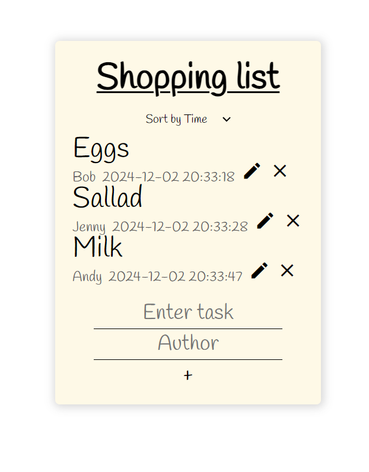
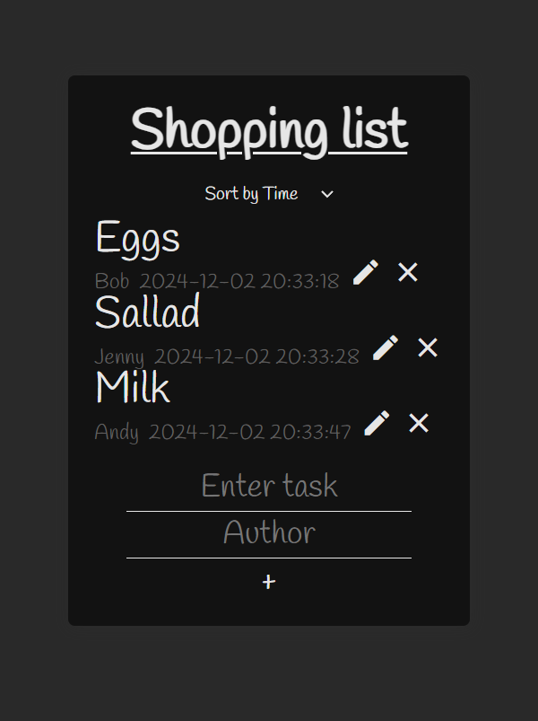

# Exercise: JS Todo-list

**A school assignment where we made a todo-list with DOM manipulation.**

_I opted for a "Shopping List"
I also decided it needed a dark mode since i didn't wanna stare at the light version while coding._

 
